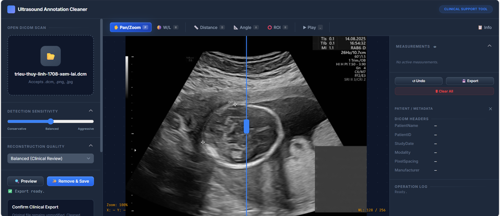

# DICOM Cleaner - Clinical Interface

A production-ready full-stack application to automatically detect and remove yellow and green annotations (such as text, markers, and measurement lines) from medical DICOM ultrasound scans. For each processed file, it produces a cleaned DICOM file alongside a PNG preview image. 

> **⚠ Medical Disclaimer**: This tool is not a certified medical device and is intended for research, archival, and second-opinion review only. Results must be validated by a clinician.



## Architecture

This application has been refactored into a modern decoupled architecture:
1. **Frontend (Vite + Vanilla JavaScript + Custom CSS)**: A responsive, clinical-grade interface featuring dual WebGL/Canvas renderers, synchronous image sliders, mask overlays, measurement tools, and accessible controls.
2. **Backend (FastAPI)**: A high-performance REST API handling DICOM parsing, HSV masking, morphological refinement, and OpenCV TELEA inpainting.
3. **Orchestration (Docker)**: Multi-container deployment system for seamless execution across environments.

```
dicom-processor/
├── docker-compose.yml      # Container orchestration
├── frontend/               # Vanilla JS + Vite UI
│   ├── components/         # HTML components
│   ├── js/                 # Controllers and utilities
│   │   ├── ui-controller.js
│   │   ├── renderer-controller.js
│   │   ├── measurement-tools.js
│   │   └── ...
│   ├── css/                # Custom styling
│   ├── Dockerfile          # Nginx multi-stage build
│   └── package.json        
└── backend/                # FastAPI service
    ├── main.py             # API Endpoints
    ├── processor.py        # Core image-processing pipeline
    ├── Dockerfile          
    └── requirements.txt    
```

## Quick Start (Docker)

The absolute easiest way to run the application is using Docker Compose.

1. **Install Docker Desktop**.
2. **Clone the repository**:
   ```bash
   git clone <your-repo-url>
   cd <your-repo-name>
   ```
3. **Build and Run the Containers**:
   ```bash
   docker-compose up --build
   ```
4. **Access the Application**:
   Open **http://localhost** in your web browser. 
   *(The API will be running simultaneously on http://localhost:8000).*

## Development (Local without Docker)

If you prefer to run the services bare-metal for development:

**1. Start the Backend API (Terminal 1)**
```bash
cd backend
python -m venv .venv
# Activate: `.venv\Scripts\activate` (Windows) or `source .venv/bin/activate` (Mac/Linux)
pip install -r requirements.txt
python main.py
```

**2. Start the Frontend UI (Terminal 2)**
```bash
cd frontend
npm install
npm run dev
```
Then navigate to the Vite local URL (e.g., `http://localhost:5173`).

## Usage Guide

1. **Upload** a `.dcm` file using the file upload panel.
2. Adjust **Detection Sensitivity** and **Reconstruction Quality** sliders if needed for optimal mask detection.
3. Click **🔍 Preview** to generate an overlay mask highlighting yellow/green annotation regions identified for removal.
4. Drag the **Image Comparison slider** to verify the detected mask against the original image.
5. Click **✨ Remove & Save** to perform inpainting and download the cleaned DICOM file.
6. Use **Measurement Tools** (Distance, Area, Angle) to analyze regions before export.
7. View **Metadata** in the drawer for complete DICOM information.